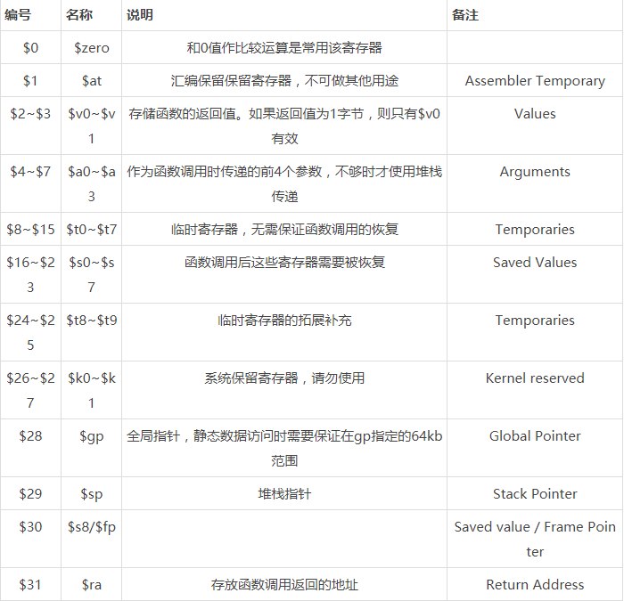
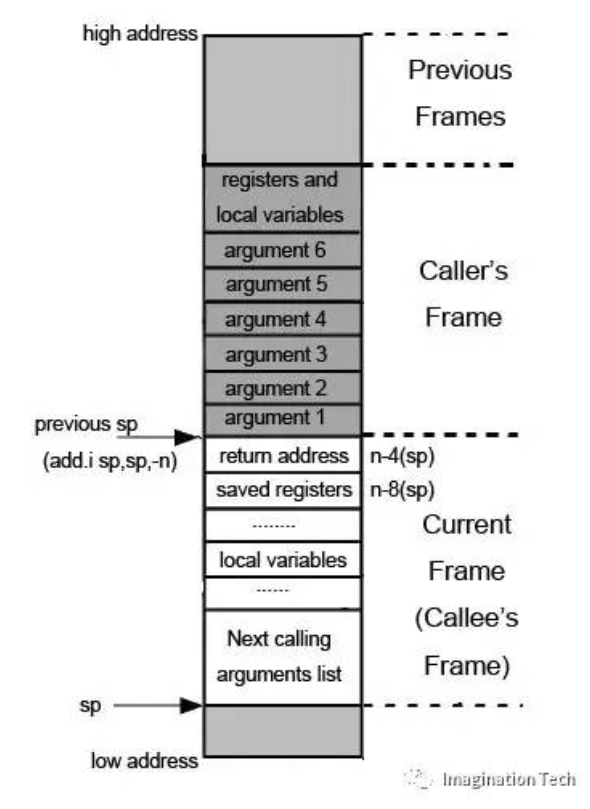
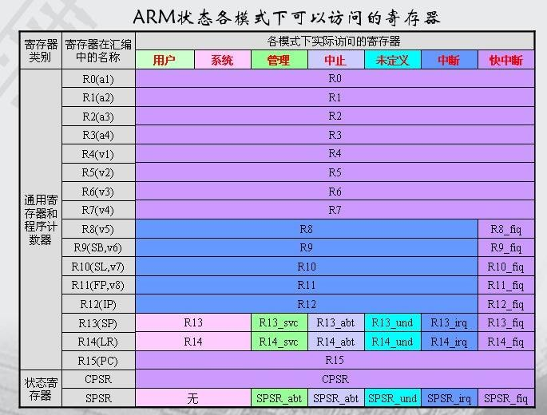
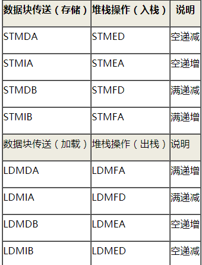

## RISC：
```
约定
BYTE(字节):      8Bits
HalfWORD(半字):  16bits
WORD(字)：       32bits
```

## MIPS

#### 1.mips特点:

*	MIPS固定4字节指令长度；
*	内存中的数据访问（load/store）必须严格对其（至少4字节对齐）；
*	跳转指令只有26位目标地址，加上2位对齐位，可寻址28位的空间，即256MB；
*	条件分支指令只有16位跳转地址，加上2位对齐位，可寻址18位的空间，即256KB；
*	流水线效应。MIPS采用了高度的流水线，其中最重要的就是分支延迟效应。在分支跳转语句后面那条语句叫分支延迟槽。实际上，在程序执行到分支语句时，当他刚把要跳转的地址填充好（填充到代码计数器里），还没有完成本条指令时，分支语句后面的那个指令就已经执行了，其原因就是流水线效应——几条指令同时执行，只是处于不同的阶段，mips不像其它架构那样存在流水线阻塞。所以分支跳转语句的下一条指令通常都是空指令nop或一些其他有用的语句。


#### 2.寄存器



#### 3.指令格式

MIPS指令长度为32位，其中指令位均为6位，其余的26位可以分为R型、I型、J型共3种类型。
R型 Opcode(6) Rd(5) Rs(5) Rt(5) Shamt(5) Funct(6)
I型 Opcode(6) Rd(5) Rs(5) Immediate(16)
J型 Opcode(6) Address(26)

各字段含义如下：

*	Opcode：指令基本操作，成为操作码；
*	Rs：第一个源操作数寄存器；
*	Rt：第二个源操作数寄存器；
*	Rd：存放操作结果的目的操作数；
*	Shamt：位移量；
*	Funct：函数，这个字段选择Opcode操作的某个特定变体。
*	
PS：所以有些指令会被优化，比如li $v0,0x7777,实际上CPU会解析成ori $v0,$zero,0x7777或addi $v0,$zero,0x7777执行。

#### 4.常用指令

* li(Load Immediate)：

用于将一个最大16位立即数 存入一个寄存器

```c
li $Rd, imm
```

* lui(Load Upper halfword Immediate)：

读取一个16位立即数放入寄存器的高16位，低16位补0。如果加载一个32位立即数（DWORD）则需要lui和addi两条指令配合完成。因为作为32位定长指令没有足够的空间存储32位立即数，只能用16位代替。

```c
lui $a1, 0x42 //将0x42放入$a1的高16位

```

* lw(Load Word)：

用于从一个指定的地址加载一个word类型的值到寄存器中

```c
lw $Rt, offset($Rs)
lw $s0, 0($sp) //取堆栈地址偏移0内存word长度的值到$s0中，$s0 = MEM[$sp+0]

```

* sw(Load Word)：

用于将源寄存器中的值存入指定的地址

```c
sw $Rt, offset($Rs)
sw $a0, 0($sp) //将$a0寄存器中的一个word大小的值存入堆栈，且$sp自动抬栈

```

#### 5.算术指令

```c
1.	add $t0, $t1, $t2 //$t0 = $t1 + $t2，带符号数相加
2.	sub $t0, $t1, $t2 //$t0 = $t1 - $t2，带符号数相减
3.	addi $t0, $t1, 5 //$t0 = $t1 + 5
4.	addu $t0, $t1, $t2 //$t0 = $t1 + $t2，无符号数相加
5.	subu $t0, $t1, $t2 //$t0 = $t1 - $t2，无符号数相减
6.	mult $t3, $t4 //(Hi, Lo) = $t3 * $t4
7.	div $t5, $t6 //$Lo = $t5 / $t6 $Lo为商的整数部分， $Hi为商的余数部分
8.	mfhi $t0 //$t0 = $Hi
9.	mflo $t1 //$t1 = $Lo


```

#### 6.系统调用

系统调用号存放在$v0中,参数存放在$a0~$a3中（如果参数过多，会有另一套机制来处理）,系统调用的返回值通常放在$v0中,如果系统调用出错，则会在$a3中返回一个错误号,最终调用Syscall指令。


#### 7.内存寻址

* 跳转指令(j)

有限的32位指令长度对于大型程序的分支跳转支持确实是个难题。MIPS指令中最小的操作码域占6位，剩下的26位用于跳转目标的编址。由于所有指令在内存中都是4字节对齐的，因此最低的2个比特位是无需存储的，这样实际可供寻址范围为2^28=256MB。分支跳转地址被当做一个256MB的段内绝对地址，而非PC相对寻址。这对于地址范围超过256MB的跳转程序而言是无能为力的，所幸目前也很少遇到这么大的远程跳转需求。

* 段外分支跳转 

可以使用寄存器跳转指令实现，它可以跳转到任意（有效的）32位地址。

* 条件分支跳转指令(b)

编码域的后 16 位 broffset 是相对当前指令PC的有符号偏移量，由于指令是4字节对齐的，长度都为4个字节，因此可支持的跳转范围实际上是2^16 * 4（指令宽度）=2^18=256KB（相对PC的-128KB~+128KB）。如果确定跳转目标地址在分支指令前后的128KB范围内，编译器就可以编码只生成一条简单的条件分支指令。

#### 8.分支跳转指令

在MIPS中，分支跳转指令本身可通过比较两个寄存器中的值来决定是否跳转。要想实现与立即数比较的跳转，可以结合类跳转指令实现

```c
1.	beq $Rs, $Rt, target //if ($Rs == $Rt): goto target
2.	blt $Rs, $Rt, target //if ($Rs < $Rt): goto target 
3.	ble $Rs, $Rt, target //if ($Rs <= $Rt): goto target 
4.	bgt $Rs, $Rt, target //if ($Rs > $Rt): goto target 
5.	bge $Rs, $Rt, target //if ($Rs >= $Rt): goto target 
6.	bne $Rs, $Rt, target //if ($Rs != $Rt): goto target


```

#### 9.直接跳转指令

* j：该指令无条件跳转到一个绝对地址。实际上，j 指令跳转到的地址并不是直接指定32位的地址（所有 MIPS 指令都是 32 位长，不可能全部用于编址数据域，那样的指令是无效的，也许只有nop）：由于目的地址的最高4位无法在指令的编码中给出，32位地址的最高4位取值当前PC的最高4位。对于一般的程序而言，28位地址所支持的256MB跳转空间已经足够大了。

  要实现更远程的跳转，必须使用 jr 指令跳转到指定寄存器中，该指令也用于需要计算合成跳转目标地址的情形。你可以使用 j 助记符后面紧跟一个寄存器表示寄存器跳转，不过一般不推荐这么做。

* jal、jalr：这两条指令分别实现了直接和间接子程序调用。在跳转到指定地址实现子程序调用的同时，需要将返回地址（当前指令地址+8）保存到 ra（$31）寄存器中。为什么是当前指令地址加8呢？这是因为紧随跳转指令之后有一条立即执行的延迟槽指令（例如nop占位指令），加8刚好是延迟槽后面的那条有效指令。从子程序返回是通过寄存器跳转完成，通常调用 jr ra。

  基于 PC 相对寻址的位置无关子程序调用通过 bal、bgezal 和 bltzal 指令完成。条件分支和链接指令即使在条件为假的情况下，也会将它们的返回地址保存到 ra 中，这在需要基于当前指令地址做计算的场合非常有用。

* b：相对当前指令地址（PC）的无条件短距离跳转指令。

* bal：基于当前指令地址（PC）的函数调用指令。

#### 10.函数调用



MIPS O32调用约定规定了执行跳转(调用)指令时，将返回值存储在ra寄存器。所占空间不大于4 byte的参数应该放在从 a0到 a3 的寄存器中，剩下的参数应该依次放到调用者 stack frame 的参数域中，并且在参数域中需要为前四个参数保留栈空间，因为被调用者使用到前四个参数时，是统一的将参数寄存器中的值放入保留的栈空间，再从保留的栈空间里面取值；如果被调用者需要使用 $s0~$s7 这些保留寄存器(saved register)，就必须先将这些保留寄存器的值保存在被调用者 stack frame 的保留寄存器域中，当被调用者返回时恢复这些寄存器值；当被调用者不是叶子函数时，即被调用者中存在对其它函数的调用，需要将 ra (return address) 寄存器  值保存到被调用者 stack frame 的返回值域中；被调用者所需要使用的局部变量，应保存在被调用者 stack frame 的本地变量域中。  

进入一个函数时需要将当前栈指针向下移动 n 比特，这个大小为n比特的存储空间就是此函数的 stack frame 的存储区域。此后栈指针便不再移动，只能在函数返回时再将栈指针加上这个偏移量恢复栈现场。由于不能随便移动栈指针，所以寄存器压栈和出栈都必须指定偏移量。  

在 RISC 计算机中主要参与计算的是寄存器，saved registers 就是指在进入一个函数后，如果某个保存原函数信息的寄存器会在当前函数中被使用，就应该将此寄存器保存到堆栈上，当函数返回时恢复此寄存器值。而且由于 RISC 计算机大部分采用定长指令或者定变长指令，一般指令长度不会超过32个位。而现代计算机的内存地址范围已经扩展到 32 位，这样在一条指令里就不足以包含有效的内存地址，所以RISC计算机一般借助于一个返回地址寄存器 RA(return address) 来实现函数的返回。几乎在每个函数调用中都会使用到这个寄存器，所以在很多情况下 RA 寄存器会被保存在堆栈上以避免被后面的函数调用修改，当函数需要返回时，从堆栈上取回 RA 然后跳转。移动 SP 和保存寄存器的动作一般处在函数的开头；恢复这些寄存器状态的动作一般放在函数的最后。

Func（arg1）大致代码：

```python
addiu   $sp, -0x28
sw      $ra, 0x24($sp)
sw      $fp, 0x20($sp)
move    $fp, $sp
sw $a0, 0x28($sp)
……………………………
lw $t1, 0x28($sp)
……………………………

move    $sp, $fp
lw      $ra, 0x24($sp)
lw      $fp, 0x20($sp)
addiu   $sp, 0x28
jr      $ra

```

#### 11.mips延迟绑定

如何找到got表？

```python
lui        gp,0x42
addiu      gp,gp,-0x7510
...............
lw      v0,-0x7fac (gp)   =>->puts     = 0x0400a00  
or       t9,v0,zero  
jalr       t9   =>puts    
```         
通过gp全局指针寄存器，根据偏移0x7fac定位到puts函数的got表地址，然后再用lw指令取出里面的地址跳去执行。由于puts函数第一次调用还没有初始化，所以跳去的地址也就是puts_plt.又称.MIPS.stubs段

```python
0x0400a00<puts_plt> lw  $t9, -0x7ff0($gp)  =>_dl_runtime_resolve
0x0400a04 <puts_plt+4>         move   $t7, $ra 
0x0400a08 <puts_plt+8>         jalr   $t9          
0x0400a0c <puts_plt+12>        li        t8,0x15  
```

先取出got开始位置处的_dl_runtime_resolve函数指针（程序初始化时被装载），然后保存返回地址到t7，将当前函数的reloc索引放入t8，跳去执行_dl_runtime_resolve。


## ARM

#### 1.寄存器



```c
1.a1-a4(参数,结果或者临时寄存器,与r0-r3同意)
2.v1-v8(变量寄存器,与r4-r11同意)
3.sb和SB(静态基址寄存器,与r9同意)
4.sl和SL(堆栈限制寄存器,与r10同意)
5.fp和FP(帧指针,与r11同意)
6.ip和IP(过程调用中间临时寄存器,与r12同意)
7.sp和SP(堆栈指针,与r13同意)
8.lr和LR(连接寄存器,与r14同意)
9.pc和PC(程序计数器,与r15同意)
10.cpsr和CPSR(程序状态寄存器)
11.spsr和SPSR(程序状态寄存器)
12.f0-f7和F0-F7(FPA寄存器)
13.s0-s31和S0-S31(VFP单精度寄存器)
14.d0-d15和D0-D15(VFP双精度寄存器)
15.p0-p15(协处理器0-15)
16.c0-c15(协处理器寄存器0-15)


```


#### 2.立即数寻址指令

MOV pc, #64 表示将立即数64放入寄存器pc。这里有一个问题：由于立即数是位于32位机器码中的，而32位机器码中除了操作数外还有操作码，这就意味着不可能用全部32bit来表示立即数。事实上，ARM机器指令中，仅用了最低的12bit来表示立即数。那么我们自然推论立即数的范围是-2048——2047，这意味着MOV pc, #8192这样的指令是非法的。但事实情况并非如此，MOV pc，#8192是合法且能正常运行的。真实情况是，ARM机器指令可以表示的立即数范围是-2^31--2^31-1，只不过它只能表示这其中的 2^12个数字而已。ARM是这样用12bit来表示一个立即数的：将12bit划分为2部分——高4位和低8位，将低8位补0扩展为32位，然后循环右移 X位（X = 高4位表示的无符号整数*2），例如：如果32位机器码中低12bit为0x512，则其表示的立即数为0x04800000

#### 3.多寄存器寻址指令

LDM{类型}（或STM{类型}）指令用于从由基址寄存器所指示的一片连续存储器到寄存器列表所指示的多个寄存器之间传送数据。其中，{类型}为以下几种情况：

```
IA 每次传送后地址加1；
IB 每次传送前地址加1；
DA 每次传送后地址减1；
DB 每次传送前地址减1；
```

例子：`LDMIA R1!,{R2-R4,R6}` ，将内存中连续存放的4个字加载到寄存器R2，R3，R4，R6中。R1中存放的是内存地址。

两点说明：
（1）R1!中的！号表示在指令执行完成后，要改变（回写）基址寄存器（R1）的值
（2）寄存器列表{R2-R4, R6}中的顺序并不要紧。最终寄存器与内存地址的对应关系是：**编号小的寄存器与内存的低地址相对应**

#### 4.堆栈寻址指令



第二列中的ED、EA、FD、 FA分别表示empty descend（空递减）、 empty ascend（空递增）、 full descend（满递减）、 full ascend（满递增），其含义是说，如果你采用的是空递减（空递增、满递减、满递增）堆栈的话，入栈操作则使用指令STMED（STMEA、 STMFD、STMFA），出栈操作则使用指令LDMED（LDMEA、LDMFD、LDMFA）。从此你再也不会为你应该使用ia、ib、da还是db来实现出、入栈操作而苦恼了。

STMED、STMEA、STMFD、STMFA和LDMED、LDMEA、LDMFD、LDMFA就是所谓的堆栈寻址指令。由此可见：为了对程序员体贴入微，ARM指令集的设计者设计了堆栈寻址指令，其实质就是**多寄存寻址指令的快捷方式**。

#### 5.跳转指令

* 【B指令】

B指令是最简单的跳转指令。一旦遇到一个 B 指令，ARM 处理器将立即跳转到给定的目标地址，从那里继续执行。注意存储在跳转指令中的实际值是相对当前PC值的一个偏移量，而不是一个绝对地址，它的值由汇编器来计算（参考寻址方式中的相对寻址）。它是 24 位有符号数，左移两位后表示的有效偏移为 26 位(前后32MB的地址空间).有符号扩展成 32 位。

* 【BL指令】

BL 是另一个跳转指令，与B指令的功能相同，也实现跳转，不同之处在于，bl在跳转的同时还要将返回地址（bl指令的下一条指令的地址）保存到lr中。该指令是实现子程序调用的一个基本但常用的手段。

* 【BX指令】BX { Rn}

ARM与thumb对比：


ARM和Thumb指令集各有自己的优点，取长补短往往会得到最好的性能。

**ARM与Thumb之间的状态转换：**

通过BX或者BLX(函数调用)指令实现状态的互相切换，BX Rn, Rn是一个装有目标地址的寄存器，当Rn寄存器里面值的最低1bit为1时，cpu从arm状态切换到thumb状态，同时将CPSR寄存器里面的T位置为1，代表程序处于thumb状态，在执行跳转过程中，PC寄存器中的最低位被舍弃，不起作用；当Rn寄存器里面值的最低1bit为0时，cpu从thumb状态切换到arm状态，同时将CPSR寄存器里面的T位清零，代表程序处于arm状态，在执行跳转过程中，PC寄存器中的最低位被舍弃，不起作用。

通常用法：BX sub+1 ===>切换为thumb

BXL同理只是多了 子程序调用。


#### 6.IDA中的arm/thumb切换技巧

按Alt+G(更改段寄存器值)
T的value从0x0改成0x1，就是指定为thumb指令集。改成arm则相反。

#### 7.函数调用

函数的第 1 ～ 4 个参数分别保存在 r0 ～ r3 寄存器中， 剩下的参数从右向左依次入栈， 被调用者实现栈平衡，函数的返回值保存在 r0 中

经典的非子叶函数调用过程

```python
STMFD   SP!, {R11,LR}
ADD     R11, SP, #4
SUB      SP, SP, #0x68
……………
……………
SUB     SP, R11, #4
STMFD   SP!, {R11,PC}
```

首先依次将返回地址(LR) , 帧指针(fp/R11)压入栈中，同时让fp(R11)指向当前函数的栈底部即返回地址处(高地址)，再sub sp开辟局部变量空间。结束时，将sp复原成STMFD后的状态，调用STMFD依次将栈中的值弹出，恢复fp，返回地址。
