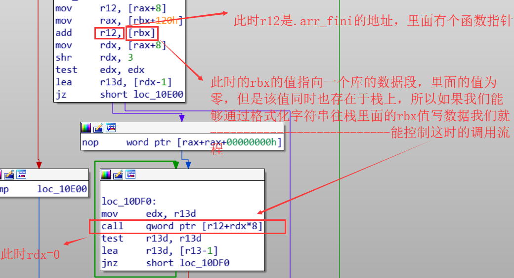
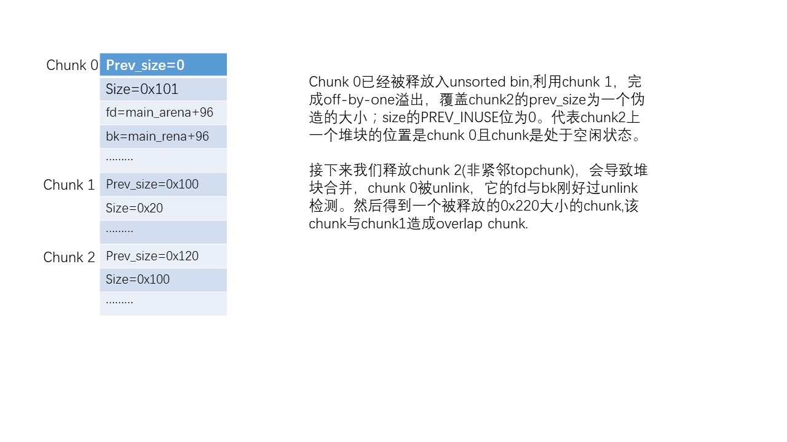
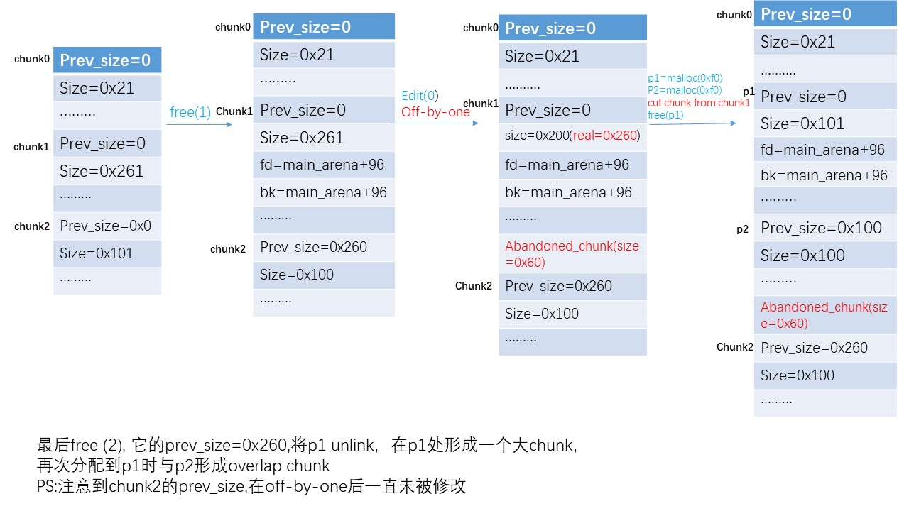
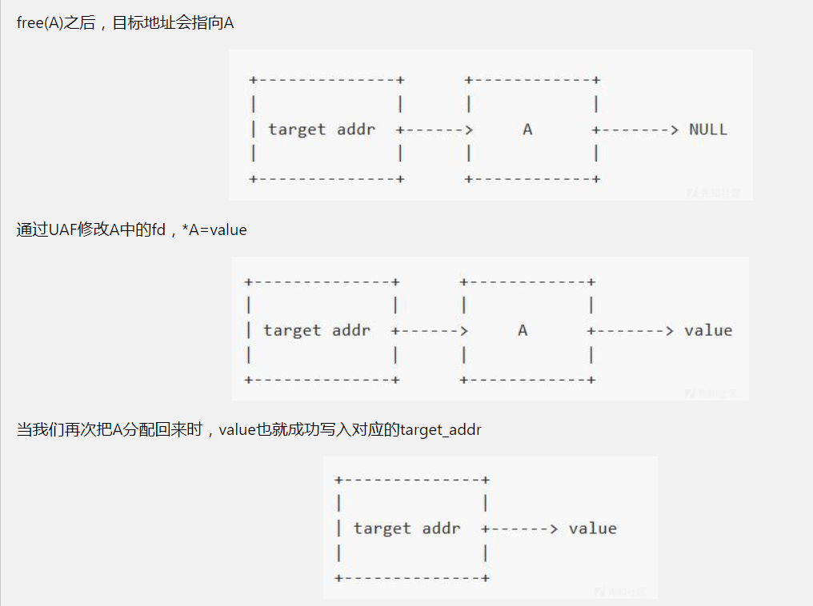

>随心情笔记，不定期更新

## one_gadgets笔记：

改malloc_hook为one_gadgets,一般malloc触发的方式，one_gadgets由于限制条件不满足，执行都不会成功，可以考虑free两次造成double free，调用malloc_printerr触发，恰好[esp+0x50]=0


在地址上__malloc_hook与__realloc_hook是相邻的，在攻击malloc_hook我们没有能够成功执行one_gadgets，但是我们可以通过将__malloc_hook更改为_libc_realloc+0x14,将__realloc_hook更该为one_gadgets。
这样的好处在于，我们能够控制__malloc_hook指向的代码的内容，规避掉_libc_realloc中部分指令，从而更改在执行one_gadgets时的占空间，创建能够成功执行one_gadgets的栈空间。这是一个很巧妙的点

虽然`__free_hook`上方几乎是"\x00"，无可用size，但是我们可以先用 unsorted attack 攻击`__free_hook`上方，在其上方踩出 size，再去劫持 __free_hook。

## 无leak函数的利用笔记：

* 没开PIE的情况

1.可申请或者构造非fastbin chunk情况，能够修改free_got --> puts_plt,下次释放一个unsorted_bin chunk(入链)或者fastbin chunk(入链)  ,程序调用链 free->free_got->puts_plt->puts 以此泄露libc地址或者heap地址。

2.只能存在fastbin chunk情况，修改 free_got 为 printf，释放一个有格式化字符串的chunk，利用构造格式化字符串漏洞 打印栈中的 libc 地址。 

* 开启PIE的情况

利用IO_write_base实现leak，详细见[https://b0ldfrev.gitbook.io/note/pwn/iofile-li-yong-si-lu-zong-jie#li-yong-iowritebase-shi-xian-leak](https://b0ldfrev.gitbook.io/note/pwn/iofile-li-yong-si-lu-zong-jie#li-yong-iowritebase-shi-xian-leak)

* 无须泄露，全程爆破的方式(不实用)

[House_of_Roman](https://b0ldfrev.gitbook.io/note/pwn/house_of_roman)

## IO_FILE笔记
程序调用exit 后会遍历 `_IO_list_all`,调用 `_IO_2_1_stdout_` 下的vatable中`_setbuf` 函数.

## malloc_consolidate笔记

`malloc_consolidate()`函数用于将 fast bins 中的 chunk 合并，并加入 unsorted bin 中。 ptmalloc中会有以下几种情况会调用`malloc_consolidate()`

1. 在`_int_malloc`的while循环之前，分配的 chunk 属于 small bin,如果 small bin 还没有初始化为双向循环链表，则调用`malloc_consolidate()`函数将 fast bins中的 chunk 合并.

2. 在`_int_malloc`的while循环之前，分配的 chunk 属于 large bin，判断当前分配区的 fast bins 中是否包含 chunk，如果存在，调用 `malloc_consolidate()`函数合并 fast bins 中的 chunk

3. 在分配chunk时 假如最后 top chunk 也不能满足分配要求，就会查看 fast bins 中是否有空闲 chunk ，若存在就调用malloc_consolidate()函数，并重新设置当前 bin 的 index，并转到最外层的循环，尝试重新分
配 chunk。

4. 在释放chunk时，遇到相邻空闲chunk合并或者与topchunk合并，如果合并后的 chunk 大小大于 64KB，并且 fast bins 中存在空闲 chunk，则会调用malloc_consolidate()函数合并 fast bins 中的空闲 chunk 到 unsorted bin 中

一些能触发`malloc_consolidate`的 trick

* scanf时可输入很长一段字符串 "1"*0x1000,这样可以导致scanf内部扩充缓冲区，从而调用init_malloc来分配更大的空间，从而导致malloc_consolidate，合并fast_bin中的空闲chunk。调用栈如图：


* 如果程序没有setbuf(stdin,0)也就是没有关闭stdin的缓冲区。getchar() 会开辟一个很大的堆块形成缓冲区，也就是申请0x400的chunk,此时fast_bin中存在chunk，就会调用`malloc_consolidate`合并

```c
pwndbg> bt

#0  __GI___libc_malloc (bytes=1024) at malloc.c:2902
#1  0x00007ffff7a7a1d5 in __GI__IO_file_doallocate (fp=0x7ffff7dd18e0 <_IO_2_1_stdin_>) at filedoalloc.c:127
#2  0x00007ffff7a88594 in __GI__IO_doallocbuf (fp=fp@entry=0x7ffff7dd18e0 <_IO_2_1_stdin_>) at genops.c:398
#3  0x00007ffff7a8769c in _IO_new_file_underflow (fp=0x7ffff7dd18e0 <_IO_2_1_stdin_>) at fileops.c:556
#4  0x00007ffff7a8860e in __GI__IO_default_uflow (fp=0x7ffff7dd18e0 <_IO_2_1_stdin_>) at genops.c:413
#5  0x00007ffff7a83255 in getchar () at getchar.c:37


```

## 程序退出

程序在执行退出流程时，会在ld-x.xx.so这个动态装载器里面调用_dl_fini函数，这个函数，利用方式见下图：



## calloc绕过 leak

2.23及 以上libc都适用

```c
#include<stdio.h>
#include<stdlib.h>
#include<string.h>

typedef long *longptr;

int main()

{
longptr v[7];
long *a,*b,*c;

a=malloc(20);
b=malloc(20);

memset(b,'A',20);
/*
for (int i=0;i<7;i++)
{
v[i]=malloc(20);
}

for (int i=0;i<7;i++)
{
free(v[i]);
}
*/
free(b);
b[-1] |= 2;

c=calloc(1,20);

for (int i=0;i<20;i++)
{
printf("%.2x",((char *)c)[i]);

}
putchar("\n");
exit(0);

}

```

给fastbin_chunk的size的IS_MAPPED域置1.通过calloc分配到时，不会被清空。

```python
chris@ubuntu:~$ ./calloc
00000000000000004141414141414141414141419


```

## stack_povit

栈迁移到.bss段时，若栈上方(低地址处)有大约0x200字节的空白空间，则执行system函数就不会报错；但我们通常使用onegadget获取shell


## fd相关 close(1)


* 对于有write函数调用的情况下.

write函数直接能够将输出重定位到0或2描述符.

```c
#include<stdio.h>
void main()
{
close(1);
write(0,"123",3);
return 0;
}

```

这时能打印123.原因是0，1，2文件描述符都指向同一个tty文件，如下：

```python
[master●]#~ file /proc/8642/fd/0
/proc/8942/fd/0: symbolic link to /dev/pts/18
[master●]#~ file /proc/8642/fd/1
/proc/8942/fd/1: symbolic link to /dev/pts/18
[master●]#~ file /proc/8642/fd/2
/proc/8942/fd/2: symbolic link to /dev/pts/18

```

* 无write函数调用情况下.

由于程序只关闭了文件描述符1，却没有关闭文件描述符0，所以我们可以修改stdout的文件描述符_fileno为0或2，则可以使得程序再次拥有了输出的能力，这时再调用printf或者puts就能输出了

* close(1)后，格式化字符串最多只能写0x2000字节，这种情况下在利用时可修改程序.bss段中的stdout指针地址为stderr指针，由源码分析，在vprintf的check时刚好能通过，这使得printf再次拥有输出能力

* close(1)时获取服务器端flag，利用重定向"cat flag >&0"

* 再调用scanf时，会取到`_IO_2_1_stdin_`结构的`fileno`,最终汇到底层系统调用read`（_IO_2_1_stdin_.fileno，buf，nbytes）`。所以有些时候如果我们能够控制`IO_stdin`结构的fileno为其它fd，再去调用scanf函数时就可以实现从其它fd读数据。


## off-by-one 构造思路

* 方法一



* 方法二



* 方法三(非特殊情况不推荐)
 
原理与方法一类似，在能泄露heap地址前提下，直接构造fake_chunk,填好指针，绕过unlink


## realloc

简化版的realloc，非mmapped分配方式

```c
__libc_realloc (void *oldmem, size_t bytes)

{

checked_request2size (bytes, nb_szie);
old_size = chunksize (oldmem);

// 如果oldmem指针为零，相当于free
if (oldmem = 0) 
{ 
	free(oldmem); 
	return 0;
}

//  如果old_size大于请求size，那就缩减old_size,如果缩减的size小于当前arch最小chunk的大小(不能切割出一个chunk)，那就直接返回原来的oldmem，剩下的交给用户处理，不多管.
if (old_size > nb_size)  
{ 
old_size=nb_size; 
if (old_size - nb_size >= 4 * SIZE_SZ) 
{
  free( oldmem + nb_size );
}  
return oldmem; 
}


// 如果old_size小于请求size，glibc2.23是按照常规malloc分配，2.27是从直接从topchunk分配
if (old_size < nb_size ) 
{

	if (glibc==2.23)
	 {
		p=malloc(bytes);
		free(oldmem);
		return p;
	 }

	if(glibc==2.27)
	 {
		p=malloc(bytes); // no_tcache 的_int_malloc不会分配tcache里面的chunk
		free(oldmem);
		return p;
	 }

}

}

```

## tcache相关

tcache_perthread_struct结构体是用来管理tcache链表：
这个结构体位于heap段的起始位置，且有size：0x251

```c
typedef struct tcache_perthread_struct
{
  char counts[TCACHE_MAX_BINS];//数组长度64，每个元素最大为0x7，仅占用一个字节（对应64个tcache链表）
  tcache_entry *entries[TCACHE_MAX_BINS];//entries指针数组（对应64个tcache链表，cache bin中最大为0x400字节
  //每一个指针指向的是对应tcache_entry结构体的地址。
} tcache_perthread_struct;

```

一个tcache链表的结构，单个tcache bins默认最多包含7个块。tcache_entry：
2.26

```c
typedef struct tcache_entry
{
  struct tcache_entry *next;//指向的下一个chunk的fd字段
} tcache_entry;

```

2.28存在bk字段所有的bk都指向tcache_perthread_struct的fd

```c
typedef struct tcache_entry
{
 //指向tcache的下一个chunk，
  struct tcache_entry *next;
  /* 这个字段是用来检测双重free释放的  */
  struct tcache_perthread_struct *key;
} tcache_entry;

```

放入tcache bin的情况:

* 释放时，`_int_free`中在检查了size合法后(小于0x400)，放入fastbin之前，它先尝试将其放入tcache
* 在`_int_malloc`中，若fastbins中取出块则将对应bin中其余chunk填入tcache对应项直到填满（smallbins中也是如此）
* 当进入unsorted bin(同时发生堆块合并）中找到精确的大小时，并不是直接返回而是先加入tcache中，直到填满：

取tcache bin中的chunk：

* 在`__libc_malloc`，`_int_malloc`之前，如果tcache中存在满足申请需求大小的块，就从对应的tcache中返回chunk
* 在遍历完unsorted bin(同时发生堆块合并）之后，若是tcache中有对应大小chunk则取出并返回：
* 在遍历unsorted bin时，大小不匹配的chunk将会被放入对应的bins，若达到`tcache_unsorted_limit`限制且之前已经存入过chunk则在此时取出（默认无限制）：


## tcache struct攻击

* tcache初始化

```c
tcache_init(void)
{
  mstate ar_ptr;
  void *victim = 0;
  const size_t bytes = sizeof (tcache_perthread_struct);
  if (tcache_shutting_down)
    return;
  arena_get (ar_ptr, bytes);
  victim = _int_malloc (ar_ptr, bytes);
  if (!victim && ar_ptr != NULL)
    {
      ar_ptr = arena_get_retry (ar_ptr, bytes);
      victim = _int_malloc (ar_ptr, bytes);
    }
  if (ar_ptr != NULL)
    __libc_lock_unlock (ar_ptr->mutex);
  /* In a low memory situation, we may not be able to allocate memory
     - in which case, we just keep trying later.  However, we
     typically do this very early, so either there is sufficient
     memory, or there isn't enough memory to do non-trivial
     allocations anyway.  */
  if (victim)
    {
      tcache = (tcache_perthread_struct *) victim;
      memset (tcache, 0, sizeof (tcache_perthread_struct));
    }
}

```

在程序需要进行动态分配时，如果是使用TCACHE机制的话，会先对tcache进行初始化。跟其他bins不一样的是，tcache是用_int_malloc函数进行分配内存空间的，因此tcache结构体是位于heap段，而不是main_arena。通常
tcache结构体位于堆首的chunk.

```c
typedef struct tcache_perthread_struct
{
  char counts[TCACHE_MAX_BINS];//0x40
  tcache_entry *entries[TCACHE_MAX_BINS];//0x40
} tcache_perthread_struct;
```

tcache的结构是由0x40字节数量数组（每个字节代表对应大小tcache的数量）和0x200(0x40*8)字节的指针数组组成（每8个字节代表相应tache_entry链表的头部指针）。因此整个tcache_perthread_struct结构体大小为0x240。


* tcache free

```c
#if USE_TCACHE
  {
    size_t tc_idx = csize2tidx (size);
    if (tcache
        && tc_idx < mp_.tcache_bins
        && tcache->counts[tc_idx] < mp_.tcache_count)//<7
      {
        tcache_put (p, tc_idx);
        return;
      }
  }
#endif

```

在将chunk放入tcahce的时候会检查tcache->counts[tc_idx] < mp_.tcache_count（无符号比较），也就是表示在tacha_entry链表中的tache数量是否小于7个。但值得注意的是，tcache->counts[tc_idx]是放在堆上的，因此如果可以修改堆上数据，可以将其改为较大的数，这样就不会将chunk放入tache了。


* tcache malloc

```c
#if USE_TCACHE
  /* int_free also calls request2size, be careful to not pad twice.  */
  size_t tbytes;
  checked_request2size (bytes, tbytes);
  size_t tc_idx = csize2tidx (tbytes);
  MAYBE_INIT_TCACHE ();
  DIAG_PUSH_NEEDS_COMMENT;
  if (tc_idx < mp_.tcache_bins
      /*&& tc_idx < TCACHE_MAX_BINS*/ /* to appease gcc */
      && tcache
      && tcache->entries[tc_idx] != NULL)
    {
      return tcache_get (tc_idx);
    }
  DIAG_POP_NEEDS_COMMENT;
#endif

```

而在tcache分配时，不会检查`tcache->counts[tc_idx]`的大小是否大于0，会造成下溢。且没有检测entries处chunk的合法性，我们若能伪造`tcache->entries[tc_idx]`的`tcache_entry`指针，那我们就能实现从tcache任意地址分配chunk。


## 关于glibc 2.29一些check的绕过

1.在unlink操作前增加了prevsize的检查机制：在合并的时候会判断prev_size和要合并chunk的size是否相同。
```c
/* consolidate backward */
if (!prev_inuse(p)) {
  prevsize = prev_size (p);
  size += prevsize;
  p = chunk_at_offset(p, -((long) prevsize));
  if (__glibc_unlikely (chunksize(p) != prevsize))
    malloc_printerr ("corrupted size vs. prev_size while consolidating");
  unlink_chunk (av, p);
}

```

这样导致了常规off-by-null的构造方式失效，但可利用残余在 large bin 上的 fd_nextsize / bk_nextsize 指针，smallbin残留的bk指针，以及fastbin的fd指针 来构造出一个天然的chunk链来绕过size检测与双向链表检测。具体见[https://bbs.pediy.com/thread-257901.htm](https://bbs.pediy.com/thread-257901.htm)


2.增加了`tcache_double_free`的检测，2.29将每个放入tcache中的chunk->bk(也是tcache entries结构的key位)设置为tcache。


```c

void
tcache_put (mchunkptr chunk, size_t tc_idx)
{
  tcache_entry *e = (tcache_entry *) chunk2mem (chunk);
  assert (tc_idx < TCACHE_MAX_BINS);

  /* Mark this chunk as "in the tcache" so the test in _int_free will
     detect a double free.  */
  e->key = tcache;

  e->next = tcache->entries[tc_idx];
  tcache->entries[tc_idx] = e;
  ++(tcache->counts[tc_idx]);
}


```
在释放tcache中的chunk时，只根据相应的tc_idx检测重复chunk

```c
/* This test succeeds on double free.  However, we don't 100%
    trust it (it also matches random payload data at a 1 in
    2^<size_t> chance), so verify it's not an unlikely
    coincidence before aborting.  */
if (__glibc_unlikely (e->key == tcache))
  {
    tcache_entry *tmp;
    LIBC_PROBE (memory_tcache_double_free, 2, e, tc_idx);
    for (tmp = tcache->entries[tc_idx];
    tmp;
    tmp = tmp->next)
      if (tmp == e)
  malloc_printerr ("free(): double free detected in tcache 2");
    /* If we get here, it was a coincidence.  We've wasted a
        few cycles, but don't abort.  */
  }
```

绕过方式：可以将同一个tcache_chunk放入不同的tcache_bin中来重新实现利用；也可以篡改chunk->key，使其e->key != tcache来绕过


3.`_int_malloc`中，使用`unsortedbin_attack`时，增加了对unsortedbin双向链表的完整性检测，导致`unsortedbin_attack`不可用.

```c
/* remove from unsorted list */
if (__glibc_unlikely (bck->fd != victim))
  malloc_printerr ("malloc(): corrupted unsorted chunks 3");
unsorted_chunks (av)->bk = bck;
bck->fd = unsorted_chunks (av);

```

但有另外的地方可利用，照样可实现任意地址写一个libc地址。原理是当从small bin中申请出chunk时，会将small bin剩余的chunk放入到tcache中，但并没有对其进行完整性检测，而且在unlink过程中会写入一个libc范围的地址(当然这个洞在引入tcache时的glibc版本就已经存在)。

```c
/* While bin not empty and tcache not full, copy chunks over.  */
while (tcache->counts[tc_idx] < mp_.tcache_count
  && (tc_victim = last (bin)) != bin)
{
	if (tc_victim != 0)
	    {
	      bck = tc_victim->bk;
	      set_inuse_bit_at_offset (tc_victim, nb);
	      if (av != &main_arena)
		set_non_main_arena (tc_victim);
	      bin->bk = bck;
	      bck->fd = bin;
	      tcache_put (tc_victim, tc_idx);
        }
}

```


4.在使用top chunk的时候增加了检查：size要小于等于system_mems，因为House of Force需要控制top chunk的size为-1，不能通过这项检查，所以House of Force不可用


## House-of-Corrosion 任意地址写

1. 可以分配较大的堆块（size <=0x3b00)
2. 通过爆破4bit,改写bk进行unsortedbin attack 改写global_max_fast变量
3. 通过分配释放特定大小的堆块,记为A **(chunk size = (offset * 2) + 0x20 ，offset为target_addr与fastbinY的差值)**
`pwndbg>    p (mfastbinptr (*)[10])target_addr - &main_arena.fastbinsY ` **target_addr**为攻击地址




所以我们至少可实现任意地址写null,存在UAF时可写任意value.


## seccomp 没禁用架构

大致思路：

1. 调用mmap申请地址，调用read读入32位shellcode
2. 同时构造用retfq切换到32位模式，跳转到32位shellcode 位置
3. 按照32位规则调用fp = open("flag")
4. 保存open函数返回的fp指针，再次调用retfq切换回64模式，跳转到64位shellcode位置
5. 执行read,write打印flag

注意点：

cs = 0x23代表32位模式，cs = 0x33代表64位模式，retfq有两步操作，ret以及set cs，所以执行retfq会跳转到rsp同时将cs设置为[rsp+0x8]，我们只需要事先在ret位置写入32位的shellcode就可以执行了，但retfq跳转过去的时候程序已经切换成了32位模式，所以地址解析也是以32位的规则来的，所以原先的rsp = 0x7ffe530d01b8会被解析成esp = 0x530d01b8，所以跳过去之后再执行push/pop的指令就会报错，所以在跳转过去后要先平衡好esp的地址，比如执行mov esp,im

