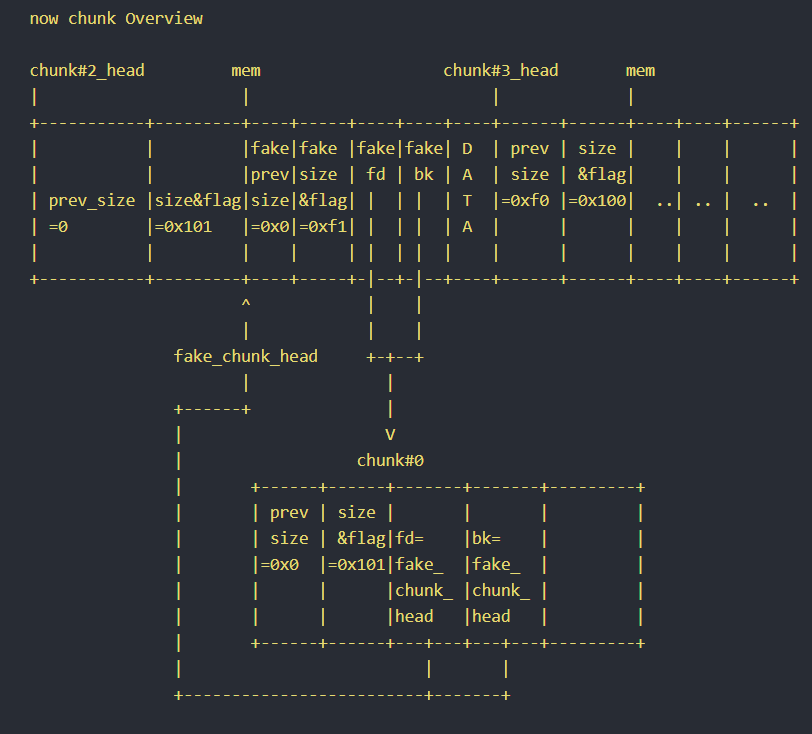

>随心情笔记，不定期更新

## one_gadgets笔记：

改malloc_hook为one_gadgets,一般malloc触发的方式，one_gadgets由于限制条件不满足，执行都不会成功，可以考虑free两次造成double free，调用malloc_printerr触发，恰好[esp+0x50]=0


在地址上__malloc_hook与__realloc_hook是相邻的，在攻击malloc_hook我们没有能够成功执行one_gadgets，但是我们可以通过将__malloc_hook更改为_libc_realloc+0x14,将__realloc_hook更该为one_gadgets。
这样的好处在于，我们能够控制__malloc_hook指向的代码的内容，规避掉_libc_realloc中部分指令，从而更改在执行one_gadgets时的占空间，创建能够成功执行one_gadgets的栈空间。这是一个很巧妙的点

虽然`__free_hook`上方几乎是"\x00"，无可用size，但是我们可以先用 unsorted attack 攻击`__free_hook`上方，在其上方踩出 size，再去劫持 __free_hook。

## 无leak函数的利用笔记：

* 没开PIE的情况

1.可申请或者构造非fastbin chunk情况，能够修改free_got --> puts_plt,下次释放一个unsorted_bin chunk(入链)或者fastbin chunk(入链)  ,程序调用链 free->free_got->puts_plt->puts 以此泄露libc地址或者heap地址。

2.只能存在fastbin chunk情况，修改 free_got 为 printf，释放一个有格式化字符串的chunk，利用构造格式化字符串漏洞 打印栈中的 libc 地址。 

* 开启PIE的情况

利用IO_write_base实现leak，详细见[https://b0ldfrev.gitbook.io/note/pwn/iofile-li-yong-si-lu-zong-jie#li-yong-iowritebase-shi-xian-leak](https://b0ldfrev.gitbook.io/note/pwn/iofile-li-yong-si-lu-zong-jie#li-yong-iowritebase-shi-xian-leak)

* 无须泄露，全程爆破的方式(不实用)

[House_of_Roman](https://b0ldfrev.gitbook.io/note/pwn/house_of_roman)

## _IO_FILE_笔记
程序调用exit 后会遍历 `_IO_list_all`,调用 `_IO_2_1_stdout_` 下的vatable中`_setbuf` 函数.

## malloc_consolidate笔记

scanf时可输入很长一段字符串 "1"*0x1000,这样可以导致scanf内部扩充缓冲区，从而调用init_malloc来分配更大的空间，从而导致malloc_consolidate，合并fast_bin中的空闲chunk。调用栈如图：


## getchar()笔记

如果程序没有setbuf(stdin,0)。getchar() 会开辟一个很大的堆块形成缓冲区，也就是申请0x1000的chunk

```c
pwndbg> bt

#0  __GI___libc_malloc (bytes=1024) at malloc.c:2902
#1  0x00007ffff7a7a1d5 in __GI__IO_file_doallocate (fp=0x7ffff7dd18e0 <_IO_2_1_stdin_>) at filedoalloc.c:127
#2  0x00007ffff7a88594 in __GI__IO_doallocbuf (fp=fp@entry=0x7ffff7dd18e0 <_IO_2_1_stdin_>) at genops.c:398
#3  0x00007ffff7a8769c in _IO_new_file_underflow (fp=0x7ffff7dd18e0 <_IO_2_1_stdin_>) at fileops.c:556
#4  0x00007ffff7a8860e in __GI__IO_default_uflow (fp=0x7ffff7dd18e0 <_IO_2_1_stdin_>) at genops.c:413
#5  0x00007ffff7a83255 in getchar () at getchar.c:37


```

 getchar()会使fp->_IO_read_ptr加1
## 程序退出

程序在执行退出流程时，会在ld-x.xx.so这个动态装载器里面调用_dl_fini函数，这个函数，利用方式见下图：


## calloc绕过 leak

2.23及 以上libc都适用

```c
#include<stdio.h>
#include<stdlib.h>
#include<string.h>

typedef long *longptr;

int main()

{
longptr v[7];
long *a,*b,*c;

a=malloc(20);
b=malloc(20);

memset(b,'A',20);
/*
for (int i=0;i<7;i++)
{
v[i]=malloc(20);
}

for (int i=0;i<7;i++)
{
free(v[i]);
}
*/
free(b);
b[-1] |= 2;

c=calloc(1,20);

for (int i=0;i<20;i++)
{
printf("%.2x",((char *)c)[i]);

}
putchar("\n");
exit(0);

}

```

给fastbin_chunk的size的IS_MAPPED域置1.通过calloc分配到时，不会被清空。

```python
chris@ubuntu:~$ ./calloc
00000000000000004141414141414141414141419


```

## stack_povit

栈迁移到.bss段时，若栈上方(低地址处)有大约0x200字节的空白空间，则执行system函数就不会报错；但我们通常使用onegadget获取shell


## close(1)


* 对于有write函数调用的情况下.

write函数直接能够将输出重定位到0或2描述符.

```c
#include<stdio.h>
void main()
{
close(1);
write(0,"123",3);
return 0;
}

```

这时能打印123.

* 无write函数调用情况下.

由于程序只关闭了文件描述符1，却没有关闭文件描述符0，所以我们可以修改stdout的文件描述符_fileno为0或2，则可以使得程序再次拥有了输出的能力，这时再调用printf或者puts就能输出了

* 格式化字符串最多只能写0x2000字节，且在利用时可修改程序.bss段中的stdout指针地址为stderr指针，由源码分析，在vprintf的check时刚好能通过，这使得printf再次拥有输出能力

* close(1)时获取服务器端flag，利用重定向"cat flag >&0"


## off-by-one 构造思路

* 方法一


* 方法二


* 方法三(非特殊情况不推荐)
 
原理与方法一类似，在能泄露heap地址前提下，直接构造fake_chunk,填好指针，绕过unlink




## realloc

简化版的realloc，非mmapped分配方式

```c
__libc_realloc (void *oldmem, size_t bytes)

{

checked_request2size (bytes, nb_szie);
old_size = chunksize (oldmem);

// 如果oldmem指针为零，相当于free
if (oldmem = 0) 
{ 
	free(oldmem); 
	return 0;
}

//  如果old_size大于请求size，那就缩减old_size,如果缩减的size小于当前arch最小chunk的大小(不能切割出一个chunk)，那就直接返回原来的oldmem，剩下的交给用户处理，不多管.
if (old_size > nb_size)  
{ 
old_size=nb_size; 
if (old_size - nb_size >= 4 * SIZE_SZ) 
{
  free( oldmem + nb_size );
}  
return oldmem; 
}


// 如果old_size小于请求size，glibc2.23是按照常规malloc分配，2.27是从直接从topchunk分配
if (old_size < nb_size ) 
{

	if (glibc==2.23)
	 {
		p=malloc(bytes);
		free(oldmem);
		return p;
	 }

	if(glibc==2.27)
	 {
		p=malloc(bytes); // no_tcache 的_int_malloc不会分配tcache里面的chunk
		free(oldmem);
		return p;
	 }

}

}

```


## 关于glibc 2.29一些check的绕过

* 在unlink操作前增加了一项检查：free chunk时 附近存在空闲chunk ，合并，对 prev chunk size 的检测，要求当前chunk的`pre_size==附近被合并chunk_size`
* 增加了tcache_double_free的检测，不过可以通过将同一个tcache_chunk放入不同的tcache_bin中来重新实现利用.也可以可以篡改chunk->key，使其e->key != tcache
* int_malloc中，使用unsortedbin时，对unsortedbin双向链表的完整性检测，unsortedbin attack不可用
* 在使用top chunk的时候增加了检查：size要小于等于system_mems，因为House of Force需要控制top chunk的size为-1，不能通过这项检查，所以House of Force不可用


## tcache struct攻击

* tcache初始化

```c
tcache_init(void)
{
  mstate ar_ptr;
  void *victim = 0;
  const size_t bytes = sizeof (tcache_perthread_struct);
  if (tcache_shutting_down)
    return;
  arena_get (ar_ptr, bytes);
  victim = _int_malloc (ar_ptr, bytes);
  if (!victim && ar_ptr != NULL)
    {
      ar_ptr = arena_get_retry (ar_ptr, bytes);
      victim = _int_malloc (ar_ptr, bytes);
    }
  if (ar_ptr != NULL)
    __libc_lock_unlock (ar_ptr->mutex);
  /* In a low memory situation, we may not be able to allocate memory
     - in which case, we just keep trying later.  However, we
     typically do this very early, so either there is sufficient
     memory, or there isn't enough memory to do non-trivial
     allocations anyway.  */
  if (victim)
    {
      tcache = (tcache_perthread_struct *) victim;
      memset (tcache, 0, sizeof (tcache_perthread_struct));
    }
}

```

在程序需要进行动态分配时，如果是使用TCACHE机制的话，会先对tcache进行初始化。跟其他bins不一样的是，tcache是用_int_malloc函数进行分配内存空间的，因此tcache结构体是位于heap段，而不是main_arena。通常
tcache结构体位于堆首的chunk.

```c
typedef struct tcache_perthread_struct
{
  char counts[TCACHE_MAX_BINS];//0x40
  tcache_entry *entries[TCACHE_MAX_BINS];//0x40
} tcache_perthread_struct;
```

tcache的结构是由0x40字节数量数组（每个字节代表对应大小tcache的数量）和0x200(0x40*8)字节的指针数组组成（每8个字节代表相应tache_entry链表的头部指针）。因此整个tcache_perthread_struct结构体大小为0x240。


* tcache free

```c
#if USE_TCACHE
  {
    size_t tc_idx = csize2tidx (size);
    if (tcache
        && tc_idx < mp_.tcache_bins
        && tcache->counts[tc_idx] < mp_.tcache_count)//<7
      {
        tcache_put (p, tc_idx);
        return;
      }
  }
#endif

```

在将chunk放入tcahce的时候会检查tcache->counts[tc_idx] < mp_.tcache_count（无符号比较），也就是表示在tacha_entry链表中的tache数量是否小于7个。但值得注意的是，tcache->counts[tc_idx]是放在堆上的，因此如果可以修改堆上数据，可以将其改为较大的数，这样就不会将chunk放入tache了。


* tcache malloc

```c
#if USE_TCACHE
  /* int_free also calls request2size, be careful to not pad twice.  */
  size_t tbytes;
  checked_request2size (bytes, tbytes);
  size_t tc_idx = csize2tidx (tbytes);
  MAYBE_INIT_TCACHE ();
  DIAG_PUSH_NEEDS_COMMENT;
  if (tc_idx < mp_.tcache_bins
      /*&& tc_idx < TCACHE_MAX_BINS*/ /* to appease gcc */
      && tcache
      && tcache->entries[tc_idx] != NULL)
    {
      return tcache_get (tc_idx);
    }
  DIAG_POP_NEEDS_COMMENT;
#endif

```

而在tcache分配时，不会检查`tcache->counts[tc_idx]`的大小是否大于0，会造成下溢。且没有检测entries处chunk的合法性，我们若能伪造`tcache->entries[tc_idx]`的`tcache_entry`指针，那我们就能实现从tcache任意地址分配chunk。


## House-of-Corrosion 任意地址写

1. 可以分配较大的堆块（size <=0x3b00)
2. 通过爆破4bit,改写bk进行unsortedbin attack 改写global_max_fast变量
3. 通过分配释放特定大小的堆块,记为A **(chunk size = (offset * 2) + 0x20 ，offset为target_addr与fastbinY的差值)**
`pwndbg>    p (mfastbinptr (*)[10])target_addr - &main_arena.fastbinsY ` **target_addr**为攻击地址


所以我们至少可实现任意地址写null,存在UAF时可写任意value.


## seccomp 禁用execve/open

大致思路：

1. 用可见字符编写shellcode 调用mmap申请地址，调用read读入32位shellcode
2. 同时构造用retfq切换到32位模式，跳转到32位shellcode 位置
3. 按照32位规则调用fp = open("flag")
4. 保存open函数返回的fp指针，再次调用retfq切换回64模式，跳转到64位shellcode位置
5. 执行read,write打印flag

注意点：

cs = 0x23代表32位模式，cs = 0x33代表64位模式，retfq有两步操作，ret以及set cs，所以执行retfq会跳转到rsp同时将cs设置为[rsp+0x8]，我们只需要事先在ret位置写入32位的shellcode就可以执行了，但retfq跳转过去的时候程序已经切换成了32位模式，所以地址解析也是以32位的规则来的，所以原先的rsp = 0x7ffe530d01b8会被解析成esp = 0x530d01b8，所以跳过去之后再执行push/pop的指令就会报错，所以在跳转过去后要先平衡好esp的地址，比如执行mov esp,im

