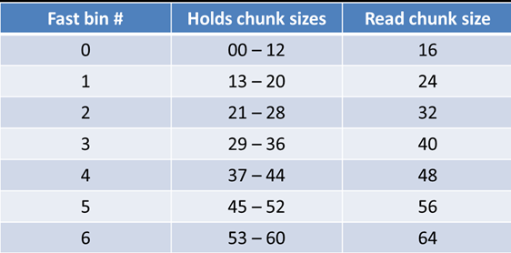

Fast bins 主要是用于提高小内存的分配效率，默认情况下，对于 `SIZE_SZ` 为 4B 的平台，
小于 64B 的 chunk 分配请求，对于 `SIZE_SZ` 为 8B 的平台，小于 128B 的 chunk 分配请求，首
先会查找 `fast bins` 中是否有所需大小的 chunk 存在（精确匹配），如果存在，就直接返回。
Fast bins 可以看着是 small bins 的一小部分 cache，默认情况下，fast bins 只 cache 了 small
bins 的前 7 个大小的空闲 chunk，也就是说，对于 `SIZE_SZ` 为 4B 的平台，fast bins 有 7 个 chunk
空闲链表（bin），每个 bin 的 chunk 大小依次为 16B，24B，32B，40B，48B，56B，64B；对
于 `SIZE_SZ` 为 8B 的平台，fast bins 有 7 个 chunk 空闲链表（bin），每个 bin 的 chunk 大小依
次为 32B，48B，64B，80B，96B，112B，128B。

以 32 为系统为例，分配的内存大小与 chunk大小和 fast bins 的对应关系如下表所示：



**idx为索引，hold_size为用户请求的size,size为实际分配的chunk_size**

以 64 为系统为例，因此 fastbin 的范围为32字节到128字节(0x20-0x80)，如下：

```nasm
Fastbins[idx=0,hold_size=00-0x18,size=0x20] 
Fastbins[idx=1,hold_size=0x19-0x28,size=0x30] 
Fastbins[idx=2,hold_size=0x29-0x38,size=0x40] 
Fastbins[idx=3,hold_size=0x39-0x48,size=0x50] 
Fastbins[idx=4,hold_size=0x49-0x58,size=0x60] 
Fastbins[idx=5,hold_size=0x59-0x68,size=0x70] 
Fastbins[idx=6,hold_size=0x69-0x78,size=0x80]

```

关于`fastbin_attack`，任意地址分配，对`chunk_size`的检测问题，由于在分配`fastbin_chunk`时，并没有做 `do_check_remalloced_chunk`检查，所以我们分配的`fastbin_chunk` 的size 只需要满足下面条件，就能申请成功

直接上源码：


```c
if (*fb != NULL
&&  __builtin_expect ( fastbin_index( chunksize(*fb)) != idx, 0))
{
errstr = "invalid fastbin entry (free)";
goto errout;
}

#define  fastbin_index(sz) \
((((unsigned int)(sz)) >> (SIZE_SZ == 8 ? 4 : 3)) - 2)
```

**宏 `fastbin_index(sz)`用于获得 fast bin 在 fast bins 数组中的 index，由于 bin[0]和 bin[1]中
的chunk不存在，所以需要减2，对于`SIZE_SZ`为4B的平台，将sz除以8减2得到fast bin index，
对于 SIZE_SZ 为 8B 的平台，将 sz 除以 16 减去 2 得到 fast bin index。**

**同时由于(unsigned int)(sz)的原因，对应64程序只取size的低4字节，所以我们在利用寻找合适size的时候，类似这种情况（0x36b0000000000040）也行，它等同于size=0x40**
