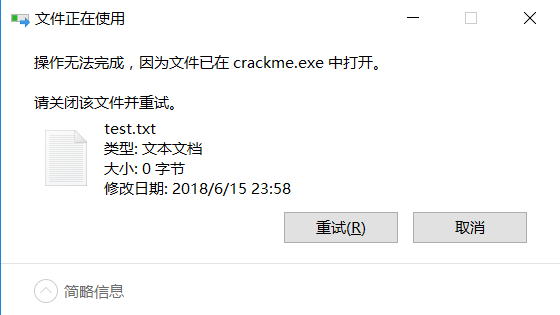

## 0x00 原理简述

代码注入，也是一种注入技术，原理和[dll远程线程注入](http://sirhc.xyz/2018/06/15/dll%E6%B3%A8%E5%85%A5%E4%B9%8B%E8%BF%9C%E7%A8%8B%E7%BA%BF%E7%A8%8B%E6%B3%A8%E5%85%A5/)大同小异,这里就不展开一一说明了。简单来说，就是通过CreateRemoteThread，创建远程线程，线程函数可自写，传入参数要注意，如果有多个参数，需要定义一个结构用来存放参数。详细代码如下:

## 0x01 代码实现
>本次注入CreateFile

1,定义一个结构体存放CreateFile参数，及函数地址。

```c
typedef struct {
	DWORD addr;
	LPCTSTR lpFileName;
	DWORD dwDesiredAccess;
	DWORD dwShareMode;
	LPSECURITY_ATTRIBUTES lpSecurityAttributes;
	DWORD dwCreationDisposition;
	DWORD dwFlagsAndAttributes;
	HANDLE hTemplateFile;
}Point;
```
2,远程注入的函数如下：

```c
DWORD _stdcall hCreateFile(LPVOID lParam)
{
	typedef HANDLE (WINAPI * PFN_CreateFile)(
		LPCTSTR lpFileName,
		DWORD dwDesiredAccess,
		DWORD dwShareMode,
		LPSECURITY_ATTRIBUTES lpSecurityAttributes,
		DWORD dwCreationDisposition,
		DWORD dwFlagsAndAttributes,
		HANDLE hTemplateFile
		);
	
	Point *p=(Point *)lParam;
	PFN_CreateFile pfnCreateFile;
	pfnCreateFile =(PFN_CreateFile)p->addr;
	
	pfnCreateFile(p->lpFileName,p->dwDesiredAccess,p->dwShareMode,p->lpSecurityAttributes,
		p->dwCreationDisposition,p->dwFlagsAndAttributes,p->hTemplateFile);
	return 0;
	}
```
3,获得CreateFile函数地址，定义注入函数hCreateFile的参数，其中LPCTSTR lpFileName这个参数是一个指向字符串的指针，所以我们要在目标进程里面分配一个空间，并写入路径字符串。

```c
DWORD dwThreadFunSize=0x400;
HANDLE	hProcess=OpenProcess(PROCESS_ALL_ACCESS,FALSE,GetPid("crackme.exe"));
Point p;
char str[]="D:\\787.txt";
HMODULE mod=GetModuleHandle("kernel32.dll");
DWORD addr=(DWORD)GetProcAddress(mod,"CreateFileA");
FreeLibrary(mod);
p.addr=addr;
p.dwDesiredAccess=GENERIC_READ|GENERIC_WRITE;
p.dwShareMode=0;
p.lpSecurityAttributes=NULL;
p.dwCreationDisposition=OPEN_ALWAYS ;
p.dwFlagsAndAttributes=FILE_ATTRIBUTE_NORMAL;
p.hTemplateFile=NULL;

LPVOID lpAllocAddr=VirtualAllocEx(hProcess,NULL,strlen(str)+1,MEM_COMMIT,PAGE_READWRITE);
BOOL bRet = WriteProcessMemory(hProcess,lpAllocAddr,str,strlen(str)+1,0);
p.lpFileName=(LPSTR)(lpAllocAddr);
```
4,将hCreateFile函数地址和参数结构体对象地址写入目标进程，最后调用CreateRemoteThread().

```c
LPVOID lpAllocAddr1=VirtualAllocEx(hProcess,NULL,sizeof(Point),MEM_COMMIT,PAGE_READWRITE);
BOOL bRet1 = WriteProcessMemory(hProcess,lpAllocAddr1,&p,sizeof(Point),0);

LPVOID lpAllocAddr2=VirtualAllocEx(hProcess,NULL,dwThreadFunSize,MEM_COMMIT,PAGE_READWRITE);
BOOL bRet2 = WriteProcessMemory(hProcess,lpAllocAddr2,(LPVOID)hCreateFile,dwThreadFunSize,0);

HANDLE hThread =CreateRemoteThread(hProcess,NULL,0,(LPTHREAD_START_ROUTINE)lpAllocAddr2,lpAllocAddr1,0,NULL);
CloseHandle(hProcess);
```

## 0x02 完整代码
>目标进程为crackme.exe,在D盘的根目录，创建一个test.txt.

```c
#include<stdio.h>
#include<windows.h>
#include<stdlib.h>
#include<Tlhelp32.h.>
#include<string.h>

typedef struct {
	DWORD addr;
	LPCTSTR lpFileName;
	DWORD dwDesiredAccess;
	DWORD dwShareMode;
	LPSECURITY_ATTRIBUTES lpSecurityAttributes;
	DWORD dwCreationDisposition;
	DWORD dwFlagsAndAttributes;
	HANDLE hTemplateFile;
}Point;

DWORD GetPid(char *szName)
{
	HANDLE hprocessSnap=NULL;
	PROCESSENTRY32  pe32 ={0};
	hprocessSnap =CreateToolhelp32Snapshot(TH32CS_SNAPPROCESS,0);
	if(hprocessSnap == (HANDLE)-1){return 0;}
	pe32.dwSize=sizeof(PROCESSENTRY32);
	if(Process32First(hprocessSnap,&pe32))
	{
		do{
			if(!strcmp(szName,pe32.szExeFile))
				return (int)pe32.th32ProcessID;
		}while(Process32Next(hprocessSnap,&pe32));
	}
	else
		CloseHandle(hprocessSnap);
	return 0;
}

DWORD _stdcall hCreateFile(LPVOID lParam)
{
	typedef HANDLE (WINAPI * PFN_CreateFile)(
		LPCTSTR lpFileName,
		DWORD dwDesiredAccess,
		DWORD dwShareMode,
		LPSECURITY_ATTRIBUTES lpSecurityAttributes,
		DWORD dwCreationDisposition,
		DWORD dwFlagsAndAttributes,
		HANDLE hTemplateFile
		);
	
	Point *p=(Point *)lParam;
	PFN_CreateFile pfnCreateFile;
	pfnCreateFile =(PFN_CreateFile)p->addr;
	
	pfnCreateFile(p->lpFileName,p->dwDesiredAccess,p->dwShareMode,p->lpSecurityAttributes,
		p->dwCreationDisposition,p->dwFlagsAndAttributes,p->hTemplateFile);
	return 0;
}

void main()
{
	DWORD dwThreadFunSize=0x400;
	HANDLE	hProcess=OpenProcess(PROCESS_ALL_ACCESS,FALSE,GetPid("crackme.exe"));
	Point p;
	char str[]="D:\\test.txt";
	HMODULE mod=GetModuleHandle("kernel32.dll");
	DWORD addr=(DWORD)GetProcAddress(mod,"CreateFileA");
	FreeLibrary(mod);
	p.addr=addr;
	p.dwDesiredAccess=GENERIC_READ|GENERIC_WRITE;
	p.dwShareMode=0;
	p.lpSecurityAttributes=NULL;
	p.dwCreationDisposition=OPEN_ALWAYS ;
	p.dwFlagsAndAttributes=FILE_ATTRIBUTE_NORMAL;
	p.hTemplateFile=NULL;
	
	LPVOID lpAllocAddr=VirtualAllocEx(hProcess,NULL,strlen(str)+1,MEM_COMMIT,PAGE_READWRITE);
	BOOL bRet = WriteProcessMemory(hProcess,lpAllocAddr,str,strlen(str)+1,0);
	p.lpFileName=(LPSTR)(lpAllocAddr);
	
	LPVOID lpAllocAddr1=VirtualAllocEx(hProcess,NULL,sizeof(Point),MEM_COMMIT,PAGE_READWRITE);
	BOOL bRet1 = WriteProcessMemory(hProcess,lpAllocAddr1,&p,sizeof(Point),0);
	
	LPVOID lpAllocAddr2=VirtualAllocEx(hProcess,NULL,dwThreadFunSize,MEM_COMMIT,PAGE_READWRITE);
	BOOL bRet2 = WriteProcessMemory(hProcess,lpAllocAddr2,(LPVOID)hCreateFile,dwThreadFunSize,0);
	
	HANDLE hThread =CreateRemoteThread(hProcess,NULL,0,(LPTHREAD_START_ROUTINE)lpAllocAddr2,lpAllocAddr1,0,NULL);
	CloseHandle(hProcess);
	
}
```
 
## 0x03 运行结果
>测试环境为win10 x64
>
>在D盘根目录创建一个test.txt文档，不能删除，除非关闭掉目标进程。


